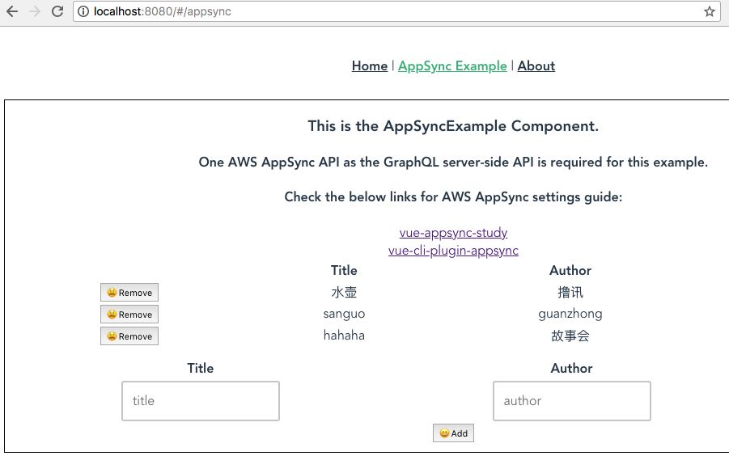

# vue-appsync-study
**Example to create a vue application to use the AWS AppSync backend**

* Application Screenshot


* DynamoDB back-end


# Option I. Streamlined approach by using [vue-cli-plugin-appsync](https://github.com/komushi/vue-cli-plugin-appsync) and [AWS Mobile CLI](https://aws.github.io/aws-amplify/media/cli_guide)
**:rocket: This is how I created a Vue Application like this repo. In one minute!**

## 1. Setup AppSync and Vue Application together
### 1-1. Check vue-cli version
:warning: Make sure you have vue-cli 3.x.x:

```
vue --version
```

### 1-2. Check AWS Mobile CLI version:
:warning: Make sure you have awsmobile-cli 1.1.x:

```
awsmobile -V
```

### 1-3. Configure AWS Mobile CLI:
**Choose your region**

```
$awsmobile configure aws

configure aws
? accessKeyId:  <accessKeyId>
? secretAccessKey:  <secretAccessKey>
? region:  ap-northeast-1
```

### 1-4. Create a vue project
Create a project with vue-cli 3.x:
**Use Babel, Router, Linter with default settings**
```
vue create my-new-app

Vue CLI v3.0.0-beta.15
? Please pick a preset: Manually select features
? Check the features needed for your project: 
 ◉ Babel
 ◯ TypeScript
 ◯ Progressive Web App (PWA) Support
❯◉ Router
 ◯ Vuex
 ◯ CSS Pre-processors
 ◉ Linter / Formatter
 ◯ Unit Testing
 ◯ E2E Testing
```

### 1-5. Apply the AppSync plugin
Navigate to the newly created project folder and add the cli plugin:

```
cd my-new-app
vue add appsync

? Add an AppSync Example page? Yes
? What is the authentication type? API_KEY
```

### 1-5. Check the AppSync settings example at awsmobilejs/backend/appsync
**Create your own AppSync settings for your own app in the future.**
```
./awsmobilejs/
└── backend
    ├── appsync
    │   ├── apiKeys.json
    │   ├── dataSources.json
    │   ├── graphqlApi.json
    │   ├── resolver-mappings
    │   │   ├── Mutation.createBook.request
    │   │   ├── Mutation.createBook.response
    │   │   ├── Mutation.deleteBook.request
    │   │   ├── Mutation.deleteBook.response
    │   │   ├── Mutation.updateBook.request
    │   │   ├── Mutation.updateBook.response
    │   │   ├── Query.getAllBooks.request
    │   │   ├── Query.getAllBooks.response
    │   │   ├── Query.getBook.request
    │   │   ├── Query.getBook.response
    │   │   ├── Query.getBooksByGender.request
    │   │   ├── Query.getBooksByGender.response
    │   │   ├── Query.listBooks.request
    │   │   └── Query.listBooks.response
    │   ├── resolvers.json
    │   └── schema.graphql
    └── mobile-hub-project.yml
```

### 1-6. Create the backend
**Check the MobileHub Backend, the AppSync Backend & the DynamoDB Table after**
```
cd my-vue-appsync-app
awsmobile init --yes
```

### 1-7. Start your app

```
npm run serve
```

*Or*

```
awsmobile run
```

# Option II. Maunal Approach
## 2. Manually Setup AWS AppSync (GraphQL API Server Side) with AWS management console

### 2-1. Default GraphQL API
```
type Query { 
    getAllBooks: [Book]
    getBooksByGender(gender: Gender): [Book]
}

type Book { 
    title: String!
    gender: Gender!
    author: String
}

enum Gender {
    Male
    Female
}

schema {
    query: Query
}
```

### 2-2. After applying to AWS AppSync with a DynamoDB Table BookTable created
**Need to mannualy update CreateBookInput and UpdateBookInput for gender (enum type)**
```
type Book {
    title: String!
    gender: Gender!
    author: String
}

type BookConnection {
    items: [Book]
    nextToken: String
}

input CreateBookInput {
    title: String!
    gender: Gender!
    author: String
}

input DeleteBookInput {
    title: String!
}

enum Gender {
    Male
    Female
}

type Mutation {
    createBook(input: CreateBookInput!): Book
    updateBook(input: UpdateBookInput!): Book
    deleteBook(input: DeleteBookInput!): Book
}

type Query {
    getAllBooks: [Book]
    getBooksByGender(gender: Gender): [Book]
    getBook(title: String!): Book
    listBooks(first: Int, after: String): BookConnection
}

type Subscription {
    onCreateBook(title: String, author: String): Book
        @aws_subscribe(mutations: ["createBook"])
    onUpdateBook(title: String, author: String): Book
        @aws_subscribe(mutations: ["updateBook"])
    onDeleteBook(title: String, author: String): Book
        @aws_subscribe(mutations: ["deleteBook"])
}

input UpdateBookInput {
    title: String!
    gender: Gender!
    author: String
}

schema {
    query: Query
    mutation: Mutation
    subscription: Subscription
}
```

### 2-3. Try Mutation createBook to add some data

```
mutation create{
  createBook(input:{title:"水许", author:"师奶庵", gender:Male}) {
    title
    author
    gender
  }
}

```


```
mutation create{
  createBook(input:{title:"嘻游记", author:"无承恩", gender:Male}) {
    title
    author
    gender
  }
}
```

```
mutation create{
  createBook(input:{title:"原始物語", author:"姿势部", gender:Female}) {
    title
    author
    gender
  }
}
```

**Check DynamoDB**
| title (S) | gender (S) | author (S) |
| ----------|----------- |------------|
| 水许       | Male       | 师奶庵      |
| 嘻游记     | Male       | 无承恩      |
| 原始物語   | Female     | 姿势部      |

### 2-4. Try Query getBook

```
query getBook{
  getBook(title:"水许") {
    title
    author
    gender
  }
}
```

```
{
  "data": {
    "getBook": {
      "title": "水许",
      "author": "师奶庵",
      "gender": "Male"
    }
  }
}
```

### 2-5. Add Resolver for Query getAllBooks and test
* Data source name: BookTable
* Request mapping template
```
{
    "version": "2017-02-28",
    "operation": "Scan"
}
```
* Response mapping template
```
$utils.toJson($context.result.items)
```

**Try Query getAllBooks**

```
query getAllBooks{
  getAllBooks {
    title
    author
    gender
  }
}
```

```
{
  "data": {
    "getAllBooks": [
      {
        "title": "嘻游记",
        "author": "无承恩",
        "gender": "Male"
      },
      {
        "title": "水许",
        "author": "师奶庵",
        "gender": "Male"
      }
    ]
  }
}
```

### 2-6. Add Resolver for Query.getBooksByGender
* Data source name: BookTable
* Request mapping template
```
{
    "version" : "2017-02-28",
    "operation" : "Scan",
    "filter" : {
        "expression": "gender = :gender",
        "expressionValues" : {
            ":gender" : { "S" : "${context.arguments.gender}" }
        }
    }
}
```
* Response mapping template
```
$utils.toJson($context.result.items)
```

**Try Query getBooksByGender**

```
query getBooksByGender{
  getBooksByGender(gender:Male) {
    title
    author
    gender
  } 
}
```

```
{
  "data": {
    "getBooksByGender": [
      {
        "title": "嘻游记",
        "author": "无承恩",
        "gender": "Male"
      },
      {
        "title": "水许",
        "author": "师奶庵",
        "gender": "Male"
      }
    ]
  }
}
```

## 3. Manually Setup Vue Application

### 3-1. Check vue-cli version
:warning: Make sure you have vue-cli 3.x.x:

```
vue --version
```

### 3-2. Create a vue project
```
vue create my-vue-appsync-app
```

### 3-3. Apply the AppSync plugin
**Navigate to the newly created project folder and add the cli plugin:**

```
cd my-vue-appsync-app
vue add appsync
```

### 3-4. Modify aws-exports.js
**Edit or create src/aws-exports.js.**
**All the AppSync info can be retrieved at AWS AppSync management console.**
```
const awsmobile = {
    'aws_appsync_graphqlEndpoint': 'https://<your_appsync_endpoint>.appsync-api.ap-northeast-1.amazonaws.com/graphql',
    'aws_appsync_region': '<your_region>',
    'aws_appsync_authenticationType': 'API_KEY',
    'aws_appsync_apiKey': '<your_api_key>',
}

export default awsmobile;
```

### 3-5. Start your app
```
npm run serve
```


